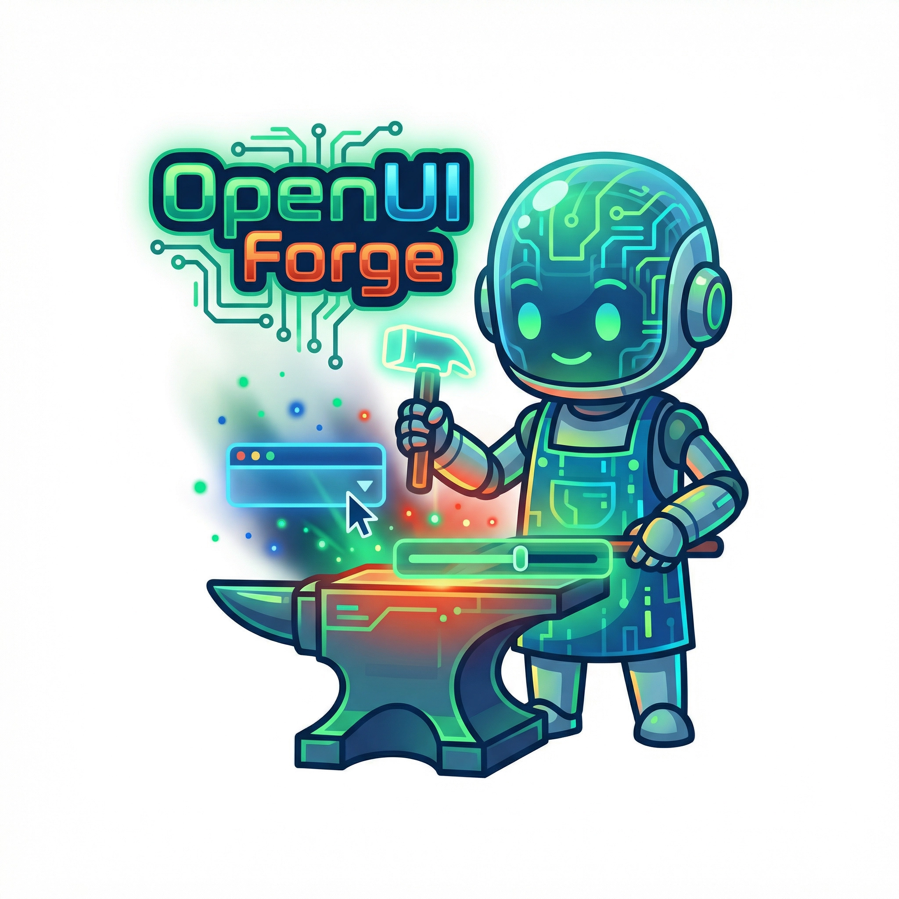

<div align="center">

</div>

# OpenUI Forge

The cross-IDE, multi-stack agent skill for [OpenUI](https://www.openui.com), the Open Standard for Generative UI. Drop OpenUI into any existing codebase, in any LLM provider, in any backend language.

[](https://github.com/OthmanAdi/openui-forge)
[](LICENSE)
[](https://skills.sh/OthmanAdi/openui-forge)
[](https://github.com/OthmanAdi/openui-forge/stargazers)
[](https://github.com/OthmanAdi/openui-forge/actions/workflows/skill-validation.yml)
[](https://spruce-prism-8yya.here.now/)

---

## What this is

OpenUI is a streaming-first generative UI framework. Models output a compact line-oriented DSL ([OpenUI Lang](https://www.openui.com/docs/openui-lang/overview)) instead of JSON or HTML, up to 67% more token-efficient than JSON-based alternatives, with progressive rendering as tokens arrive and graceful handling of hallucinated components.

`openui-forge` is an agent skill that handles the parts the official OpenUI scaffolder doesn't:

- Adds OpenUI to **existing** projects (the canonical `npx @openuidev/cli create` is greenfield-only).
- Ships **non-JavaScript backend templates**: Python (FastAPI), Go (net/http), Rust (Axum).
- Wires up **any LLM provider directly**: OpenAI, Anthropic, LangChain, Vercel AI SDK, plus any OpenAI-compatible endpoint (Gemini, OpenRouter, xAI, DeepSeek) via `OPENAI_BASE_URL`.
- Mirrors to **11 agent platforms** beyond Claude Code so the same skill content is available in Cursor, Gemini CLI, Codex, Kiro, Continue, Factory, OpenCode, Pi, Mastra, and more.

It complements the official [`thesysdev/openui` skill](https://github.com/thesysdev/openui/tree/main/skills/openui), which targets a Next.js + OpenAI scaffold. Use this one when your stack does not match that default.

---

## Install

```bash
# Full skill (scaffolding, components, integration, validation, prompt generation)
npx skills add OthmanAdi/openui-forge --skill openui-forge -g

# Or a single stack-specific variant
npx skills add OthmanAdi/openui-forge --skill openui-forge-openai     -g
npx skills add OthmanAdi/openui-forge --skill openui-forge-anthropic  -g
npx skills add OthmanAdi/openui-forge --skill openui-forge-langchain  -g
npx skills add OthmanAdi/openui-forge --skill openui-forge-vercel     -g
npx skills add OthmanAdi/openui-forge --skill openui-forge-python     -g
npx skills add OthmanAdi/openui-forge --skill openui-forge-go         -g
npx skills add OthmanAdi/openui-forge --skill openui-forge-rust       -g

# Chinese localization
npx skills add OthmanAdi/openui-forge --skill openui-forge-zh         -g
```

---

## Commands

| Command | Description |
|---------|-------------|
| `/openui` | Smart detection. Analyzes the project state and recommends the next action. |
| `/openui:scaffold` | Add OpenUI to an existing project, or scaffold a new one via the official CLI. |
| `/openui:component` | Create a new component with Zod schema and React renderer. |
| `/openui:integrate` | Wire up the LLM backend for the detected stack. |
| `/openui:prompt` | Generate or regenerate the system prompt from the component library. |
| `/openui:validate` | 10-step validation pipeline (deps, library, prompt, route, page, CSS, adapter, CORS, etc.). |

---

## Supported stacks

| Stack | Language | LLM | Backend stream | Frontend `streamProtocol` |
|-------|----------|-----|----------------|---------------------------|
| OpenAI SDK | TypeScript | OpenAI (or any OpenAI-compatible via `OPENAI_BASE_URL`) | NDJSON via `response.toReadableStream()` | `openAIReadableStreamAdapter()` |
| Anthropic SDK | TypeScript | Anthropic Claude | SSE (Anthropic events converted) | `openAIAdapter()` |
| LangChain / LangGraph | TypeScript | Any (via LangChain) | SSE (LangChain chunks converted) | `openAIAdapter()` or `langGraphAdapter()` |
| Vercel AI SDK | TypeScript | Any (via AI SDK) | Native UIMessageStream | Native `processMessage` (no adapter) |
| Python (FastAPI) | Python | OpenAI / Anthropic | SSE | `openAIAdapter()` |
| Go (`net/http`) | Go | OpenAI-compatible HTTP | SSE passthrough | `openAIAdapter()` |
| Rust (Axum) | Rust | OpenAI-compatible HTTP | SSE via Axum `Sse<...>` | `openAIAdapter()` |

> Adapter selection follows one rule: match the backend's response format. SSE (`data: {json}\n\n`) pairs with `openAIAdapter()`; NDJSON (one raw JSON per line) pairs with `openAIReadableStreamAdapter()`.

---

## Architecture

```
Component Library     System Prompt        LLM Backend
(Zod + React)    -->  (generated)     -->  (any provider, OPENAI_BASE_URL-routable)
                                                |
                                                | streams OpenUI Lang
                                                v
Live UI          <--  Parser           <--  streamProtocol Adapter
(React)               (@openuidev/             (openAIAdapter, openAIReadableStreamAdapter,
                       react-lang)              langGraphAdapter, openAIResponsesAdapter, ...)
```

Define components with Zod schemas + React renderers, assemble them into a library, generate a system prompt, the LLM streams OpenUI Lang, the adapter normalizes the byte stream into events, and the parser renders React components progressively.

**Upstream packages (verified against the npm registry):**

| Package | Purpose |
|---------|---------|
| `@openuidev/lang-core` | Framework-agnostic substrate: parser, validation, prompt generation |
| `@openuidev/react-lang` | React binding: `defineComponent`, `createLibrary`, `Renderer` |
| `@openuidev/react-headless` | State: `ChatProvider`, streaming adapters, message formats (Zustand) |
| `@openuidev/react-ui` | UI: `FullScreen` / `Copilot` / `BottomTray` layouts, 30+ built-in components, theming |
| `@openuidev/cli` | CLI: scaffold apps, generate system prompts |

---

## Supported agent platforms

Skill content is mirrored to each platform's expected directory by `scripts/sync-platforms.{sh,ps1}`, so installing the skill on any of these picks up the same source-of-truth content:

Claude Code, Cursor, Gemini CLI, Kiro, Codex CLI, CodeBuddy, Continue, Factory, OpenCode, Pi, Mastra.

---

## Links

- [OpenUI documentation](https://www.openui.com/docs)
- [OpenUI on GitHub](https://github.com/thesysdev/openui)
- [OpenUI Discord](https://discord.com/invite/Pbv5PsqUSv)
- [LLM-readable docs (for AI agents)](https://www.openui.com/llms.txt) ([full corpus](https://www.openui.com/llms-full.txt))
- [skills.sh listing](https://skills.sh/OthmanAdi/openui-forge)
- [Author portfolio](https://othmanadi.com)

---

Made by [OthmanAdi](https://github.com/OthmanAdi)
